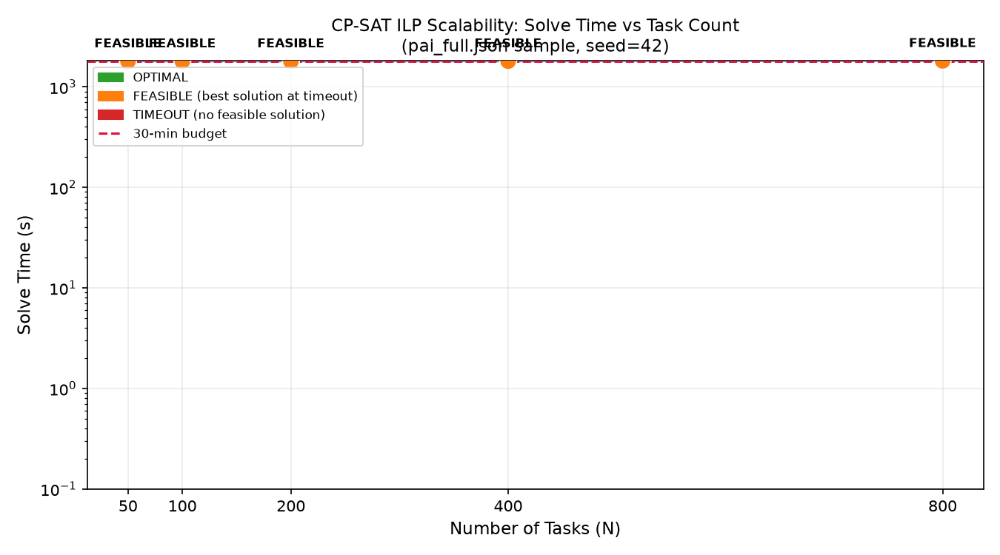

# EVA Scheduler vs CP-SAT ILP: Comparison Report

_All scheduler costs are total cloud spend ($) over the full simulation horizon._  
_CP-SAT models the static bin-packing ILP from EVA paper §4.1: minimize hourly cost_  
_of instances needed to pack all 200 tasks simultaneously._

## Section 1 — Cost Comparison Table (200-task `pai_200` trace)

| Scheduler / Method | Total Cost ($) | Solve / Run Time | % of No-Packing | Notes |
|---|---:|---:|---:|---|
| NaiveScheduler | 35,858.35 | 678301s (sim) | 100.0% |  |
| EVAGangScheduler | 25,190.69 | 707401s (sim) | 70.3% |  |
| StratusScheduler | 29,050.42 | 738901s (sim) | 81.0% |  |
| OwlScheduler | 28,936.19 | 716401s (sim) | 80.7% |  |
| SynergyScheduler | 33,058.43 | 679501s (sim) | 92.2% |  |
| CP-SAT (ILP) | 730.27 | 1861.4s | 2.0% | FEASIBLE; best_bound=$581.66 |

> **No-Packing baseline** = `NaiveScheduler` ($35,858.35).  

> EVA (`EVAGangScheduler`) achieves the lowest cost among dynamic schedulers ($25,190.69, 70.2% of No-Packing).

> **CP-SAT beats all schedulers**: $730.27 < $25,190.69 (EVAGangScheduler).

## Section 2 — CP-SAT Scalability Sweep

Tasks sampled from `pai_full.json` (6,274 jobs) with `random.seed(42)`.  
Time limit: **30 minutes** per solve.  
Scale costs = $/hr of instances needed to place all N tasks simultaneously.

| N Tasks | Status | Total Cost ($) | Best Bound ($) | Solve Time (s) |
|---:|---|---:|---:|---:|
| 50 | FEASIBLE | 187.29 | 140.26 | 1800.8 |
| 100 | FEASIBLE | 373.69 | 288.87 | 1801.5 |
| 200 | FEASIBLE | 736.82 | 2.32 | 1802.1 |
| 400 | FEASIBLE | 1,411.35 | 0.18 | 1803.0 |
| 800 | FEASIBLE | 2,935.92 | 3.39 | 1814.6 |

## Section 3 — Scalability Plot

_Dashed red line = 30-minute budget (1800 s).  
🟢 OPTIMAL  🟠 FEASIBLE (timeout with solution)  🔴 TIMEOUT (no solution)_
